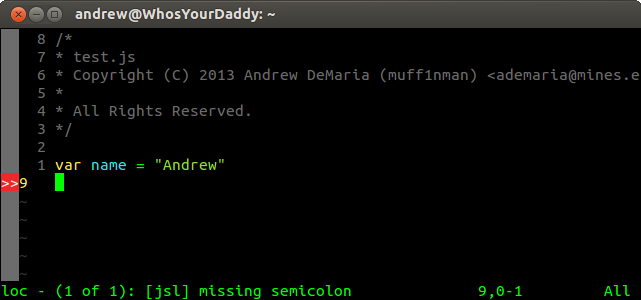

2013.09.08
(religion, catholicism, beggars)
------------

We've all been there.  You've pulled up the streetlight and standing at the
corner is a scruffy looking man (I've hardly seen women), with dirty clothes and
his few belongings with a cardboard sign.  The signage varies wildly; "Need
food, war veteran", "3 kids and no money", or even "Need alcohol". Except for
the last one, the verbage is actually very similar; I am in need of your help,
please give me money. 

So when you are coming up to that stop light, you may be thinking, "Oh great,
another homeless person."  But here comes the catch.. We all think of some
excuse not to roll down the window.  I have caught myself doing this so many
times. Some of my reasons have been; I dont have any cash, I'm not rich and
don't have any to spare, the homeless person is just going to buy drugs/alcohol
with it, Im in a hurry, or even, they're on the right side of the car (the
passenger side) and it is too inconvienent. Im sure you have your reasons too. 

One of my common reasons was the thought that they should just go to a shelter.
My parents give to a few of those shelters anyways.  So why don't they just go
there?  Maybe they just want drugs and/or alcohol?  So I don't give them any
money.

Recently, I changed my mind about this.  And here is why.  When we chance upon
that homeless person on the side of the street we only have 2 seconds or so to
get an ever so short a glimpse into that persons life.  How is it possible for
us to judge whether that person needs money or not. How is it possible to judge
whether their intensions are good based on this short happenstance?

So rather than being the judge of who gets money or not, I have decided to give
out money to every single person who asks me for it. It may not be much, as I
ususally don't carry around a whole lot of cash, but when I see a homeless
person with that chicken scratch handwriting on a piece of cardboard, I dont
turn them down.  5, 10, 20 or even 2 if I am running low.  Just anything, and
here is why.  

There is so much more story behind the eyes of a homeless person that you or I just
cannot see.  They may have lost the capability to work due to a disability, they
may have no education, they may have had their house burn down, or maybe they
are just lazy.  The thing is that we cannot distinguish the difference.  My Dad
told me this story of a homeless guy once.  He would sit in the business
district of the Denver Tech center and ask for money. His sign was simple,
"Homeless, need help" and he looked the part of one.  Untrimmed beard, dirty
face, torn clothing. Perhaps due to the bustle of the area he had chosen to
stake out, many people would help him out throughout the day.  However, at the
end of the business day, that homeless person would transform.  He would walk
down to the grocery store where his car was parked, take off the fake beard, put
on a nice shirt and drive away. An imposter if you will, making a living from
disguising as a homeless person.

So we should just never give the street beggers money right?  I had a friend
once, who mentioned that instead of giving out money to homeless, she would
instead give out granola bars. She would buy one of those huge green boxes of Nature
Valley bars from Costco and whenever she saw someone on the side of the street,
she would hand them a couple of these bars. 

Great idea, right?  After all, the homeless just need food, and this will
prevent not only the imposters but also prevent them from buying anything like
drugs. Not to say that my good friend, or anyone who does a similar thing is
wrong, but this is not the way to think about it.  Instead we should trust in
God and the Holy Spirit acting in that individual to purchase the needed
essentials of life with that money we give out.  We as individuals are merely
acting as catalysts of Gods Grace, pieces of one large jigsaw puzzle and as such
we cannot see our neighbor and cannot see the grand scheme of how their life
fits into the world. Therefore, we should not limit the potential of the Holy
Spirit by providing only a granola bar, we should give out the more useable
resource.. cash.

Another way to think of it is to imagine that homeless person as Jesus.  Jesus
with a cardboard sign and the rough broken English of a foreigner asks you for
money.  Are you first going to ask him what he is going to do with it?  Of
course not.  You immediately assume his intentions are Holy and give him
whatever he asks of you. Now, this example might be a tad extreme because if we
went through a capitalistic society imagining everyone else as Jesus, we
wouldn't make it very far ourselves would we?  But here is where your good
judgement comes to play.  Instead of drinking that coffee that morning, or
buying that candy bar at the store, don't. Give it to someone else in the hope
that your sacrifices will be the joy of someone else.  

With that said, I get very angry at Catholics sometimes.  I sat in Mass one day.
The homily was about their lastest campaign... To raise money for renovating
their education center. He mentioned they had raised all the money they
needed for the first phase of the project, to replace the roofing and replace
the ventialiation systems, and that they were well on there way to funding phase 2 and 3
which were a couple years out yet.  The priest went on to say how the church had
raised an additional $900,000 for the arch bishops appeal and how they had done
an excellent job.  

Okay great.  The arch bishops appeal is a great cause that
helps out families in need. Nothing too different here.

Now after Mass was over, I was waiting in the line of cars to turn out of the
parking lot.  As I got closer I noticed a man and his wife. The former was
holding a cardboard sign and the latter was cradling a baby. My first thought
was that this family will get plenty attention from all the good meaning
Catholics leaving Mass.  But you know what?  Not a single one of them stopped.
Not even me. I am sure we all had our reasons.  Mine was that I had no cash at
the time. And shame on the hypocrit I am! Nevertheless, I would like to point out
that for Catholics, it is so easy for us to give gobs of money to a formal appeal from the
church with these nice convienient envelops and pencils they have waiting for us
in the pews.  But once outside of the Church, we *lose* our Catholicism, nay,
our Christianity. If your cause isn't presented to us in a nice wrapped up
envelope, and you don't take a credit card, forget it. You wont get even a cent.
You might as well have asked a bunch of college students to give you money, and
probably even had better luck with that group.

I would love to be wrong on this, I really would. I would love to believe that
every single one of those cars that passed that family had a much better reason
for doing so than I. I just wish the world I lived was more compasionate.  Don't
get me wrong, Im sure you few compasionate people are working diligently to make
the world a better place and not getting any recognition for your service. But I
also sure that many of us, myself included, could learn a couple lessons in
this department.

2013.08.05
(javascript, lint, vim, tech)
--------
As promised here are the instructions for setting up JavaScript Lint 

*Note these instructions apply for version 0.3.0*. 

First you will need to setup [eclim](http://eclim.org/index.html). Eclim is a
layer of software that lets you interact with eclipse in vim, or conversely, use
vim while in eclipse.  You\'ll want to choose the headless install process
(otherwise you are just using Eclipse at which point this guide isn\'t very
relevant). Although I may touch on setting up eclim at some time in the future,
it is a bit outside of the scope of the post for today. You won\'t actually need
to have eclimd running, as the validation checker is a utility file that works
strictly in vim.  With that in mind, it should be relatively easy for one to
pluck the script out of the eclimd files and set it up as a separate vim
plugin.. 

Next, you will need to download the
[source](http://www.javascriptlint.com/download.htm) for JavaScript Lint.
Extract and `cd` into the `src/` directory.  Inside you should find a README
file that has some very rough instructions.  The README references `gmake` which
according to the interwebs is essentially just `make` on modern day Linux
machines.  At any rate, run:

~~~ bash
export BUILD_OPT=1 # turns off debugging
make -f Makefile.ref
~~~

At this point I was hesitant to run a `make install` and in fact, I did not even
see a target in the Makefile.  Instead what I opted to do was to drop the
executable inside my `/opt` directory. The excutables are stored in a generated
directory named `Linux_All_OPT.OBJ` (or `Linux_All_DBG.OBJ` if you did not set
`BUILD_OPT`).  I then copied this directory's contents to my `/opt` directory.

~~~ bash
sudo mkdir /opt/jsl-0.3.0
sudo cp Linux_All_OPT/* /opt/jsl-0.3.0
~~~

Finally add the path to the executable to your `PATH` envirnonment variable.
You now should be able to run `jsl` from the command line. The vim script will
automatically do the rest at this point provided it can find the executable.  `which jsl`
is your friend here.

2013.08.04
--------
(javascript, lint)
Just a short one today...

Javascript is an interesting language.  It combines the syntax structure of C,
Java and other bracey languages with a dynamically typed one like Python.  Yet
at the same time it isn\'t quite Object Oriented with a hint of Functionalism.  

Right from the get-go Javascript has felt clunky to me.  Its like a hybrid
language that can\'t quite decide what its meant for.
[JQuery](http://jquery.com/) has made working with the language much more
enoyable but I still haven\'t reached a point of being able to put Javascript
on my tool belt. However, I did find something bringing me one step
closer:  [JavaScript Lint](http://www.javascriptlint.com/)  integration with Vim. [Source
Forge](http://sourceforge.net/projects/javascriptlint/)

JavaScript Lint allows me to write all my Javascript in vim and when I save a file, it
produces nice errors next to the line numbers. It allows for immediate feedback
and saves a trip to the browser and back.  It seems pretty solid (I haven't run
into any issues yet) but it also seems that development on the project has
stalled a bit. **Update 2013.09.05** Here is a
[fork](https://github.com/davepacheco/javascriptlint) of the project that seems
a bit more updated.

Tomorrow I\'ll hopefully have the installation instructions up for \*Nix
machines.

2013.07.28
(bitmarket, ruby)
--------

So I have been working on this awesome new project of mine called bitmarket.
It\'s a cool library that lets you automate bitcoin trading (and perhaps other
currencies if I\'ve modularized it right..)  But at any rate the idea is that
you can setup a couple algorithms of your own and then let this library handle
all the rest.  For example, I might think that if I buy bitcoins when the price
is 4% below the 2 day moving average and its a Monday but sell when its 10%
above the moving average and its Friday that I would strike it rich.  Well this
library allows you to test your hypothesis and possibly make (or break) your
day!

Here is an example \'algorithm\'/demo program that I made the other day. The API
is still a little off from being finalized as there are some tweaks I would
like to do.

~~~ ruby
#! /usr/bin/env ruby
#
# Copyright © 2013 Andrew DeMaria (muff1nman) <ademaria@mines.edu>
#
# All Rights Reserved.

require_relative 'bitmarket'

DATABASE_URL = "sqlite:////home/andrew/bitbite.db"
Bitmarket::History.setup DATABASE_URL
Bitmarket::Trader.setup DATABASE_URL

class SmartTrigger < Bitmarket::Trigger

	def trigger
		if b_meter > 1
			Bitmarket::MarketStrategy.new( :sell, BigDecimal.new("0.2"), :btc, get_current_value, :usd)
		elsif b_meter < 0 
			Bitmarket::MarketStrategy.new( :buy, BigDecimal.new("0.2"), :btc, get_current_value, :usd)
		else
			Bitmarket::MarketStrategy.new( :nothing, nil, nil, nil, nil )
		end
	end

	def get_current_value
		Bitmarket::Exchange.current_price
	end
end

# build strategy
strategy = Bitmarket::Strategy.new
strategy.add( SmartTrigger.new, :smart_trigger )

# build analyzer
analyzer = Bitmarket::Analyzer.new( strategy )

# create bank
bank = Bitmarket::Bank.new( {usd: 100, btc: 2} )

# build trader
trader = Bitmarket::LoggerTrader.new( bank )

# final step
bit = Bitmarket::Bitmarket.new

bit.start_historian(30)
bit.start_analyzing( analyzer, 60)
bit.start_trading( trader )

sleep 

bit.stop_historian
bit.stop_analyzing
bit.stop_trading
~~~

Eventually I would like to make a DSL (Domain Specific Language) for it so that
it takes care of the setup and tear down process and so that the language for
the triggers is simple and straight forward, but for now this will have to
suffice. 

Although its close to being able to sync up with the MtGox bitcoin exchange, I
am testing it extensively and trying to create my own good algorithms :)  As you
can see, right now it will only log trades and use a top level bank class that
is not hooked up with the MtGox API, but again this is in the tubes!

The only remaining question becomes... do I go open source? On one hand it would
be nice to get some more contributors on board to expand and test it.  Yet what
if it becomes popular enough that it stablizes the bitcoin currency and I can no
longer make a profit off its volatility?  Or maybe this could expand to be
compatible with other currencies and become popular with more serious currency
traders?  You never know...

2013.07.01 
(music, lastfm, banshee)
--------

I just found one of the coolest things that I wish I would have found years ago!
You know when you get those songs from random places; friends, cds, shady places
on the internet, etc and for whatever reason you don\'t get the track information
with the song?  It bugs the crap out of me, mostly because I like my music
library nice and neat. 

Introducing the Last.fm fingerprint plugin for Banshee.  This gives me the
option to right click on any song in my library and have it match the sound
signature with one on Last.fm\'s service. Of the 20 or so songs I tried it out
with, it worked perfectly and was able to find the correct artist, ablum and
title in addition to the other good info.  Neato!

2013.06.30
(blog, make, website)
--------

Well, I have been meaning to create a blog for quite some time, if for no other
reason than to document my swimming through life\'s turbulent waters.  I plan on
keeping heavily to ranting on my new discoveries in technology and computing but
occasionally I am sure you will find other remnants of my life such as recent
pictures. 

As far as the site goes, I plan on redesigning it as I have time.  Right now it
looks awful, but then again I put it together hastily. Also, I have decided that I enjoy using
Amazon Web Services.  This site, for example, is hosted on an s3 bucket and
deployed using a short but sweet Makefile script. Most of the work is actually
done with a neat tool called [s3 tools](http://s3tools.org/s3cmd) and it seems
perfect for deploying public assets such as a website.

Here is what the Makefile looks like:

~~~ Makefile
MD = kramdown
MD_ARGS = --coderay-line-numbers table

all : buildSite

target/%.html : header.htm footer.htm %.htm
	@cat header.htm $*.htm > target/$*.html
	@echo "" | cat - $*.kramdown 2>/dev/null | $(MD) $(MD_ARGS) >> target/$*.html
	@cat footer.htm >> target/$*.html

buildSite: targetDir target/about.html target/index.html target/code.html target/photography.html target/recent.html target/css target/resources target/downloads target/favicon.png

targetDir:
	@mkdir -p target

target/favicon.png : favicon.png 
	@cp favicon.png target/favicon.png

target/css: css css/pages
	@rm -rf target/css
	@cp -r css target

target/resources: resources
	@rm -rf target/resources
	@cp -r resources target

target/downloads: downloads
	@rm -rf target/downloads
	@cp -r downloads target

clean : 
	@rm -rf target

test:
	@nohup firefox target/index.html & > /dev/null

deploy: buildSite
	s3cmd sync -M  --delete-removed  --exclude-from=".gitignore" --exclude=".gitignore" --acl-public --mime-type="text/css" target/css/ s3://andrewdemaria.com/css/
	s3cmd sync -M  --delete-removed --exclude-from=".gitignore" --exclude=".gitignore" --acl-public target/ s3://andrewdemaria.com/
~~~

It\'s a bit hackish in some aspects. The one ugly line is line 8.  I wanted to
have one target declaration for all the different pages.  The one page that is
different is the page you are reading which is compiled with kramdown. To get
around this all pages look for a kramdown file.  If its not there, some empty
tags get pushed into the html. 

Eventually I may decide to move on to a Rakefile or an Ant script, but for now
it seems to do the job well.

Now to see how well I keep up on posting frequently :)

